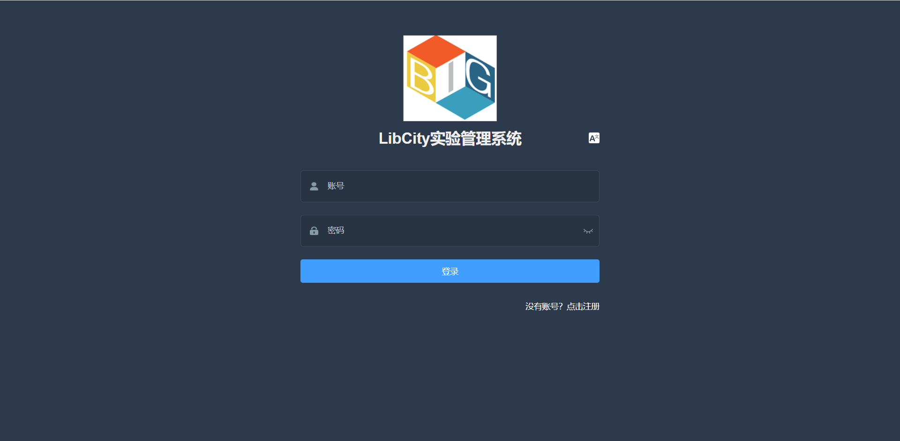
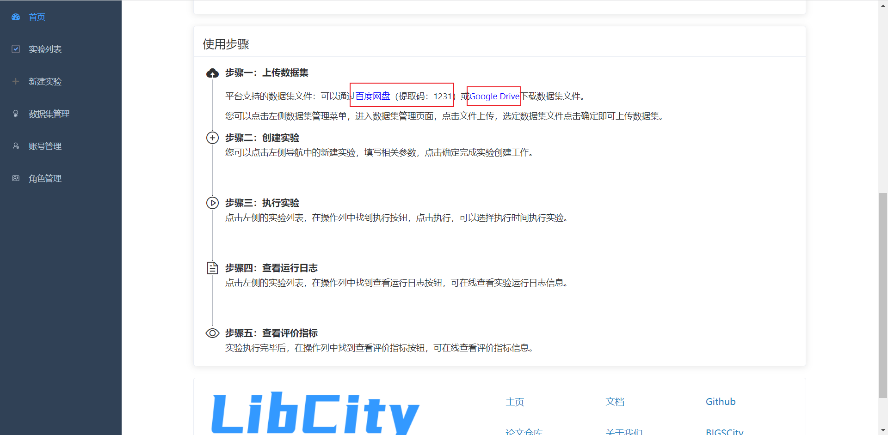
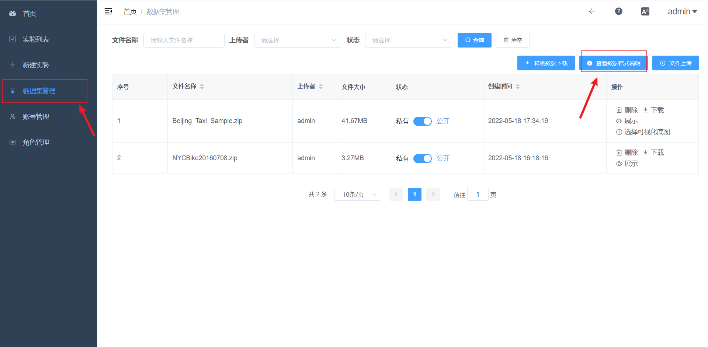
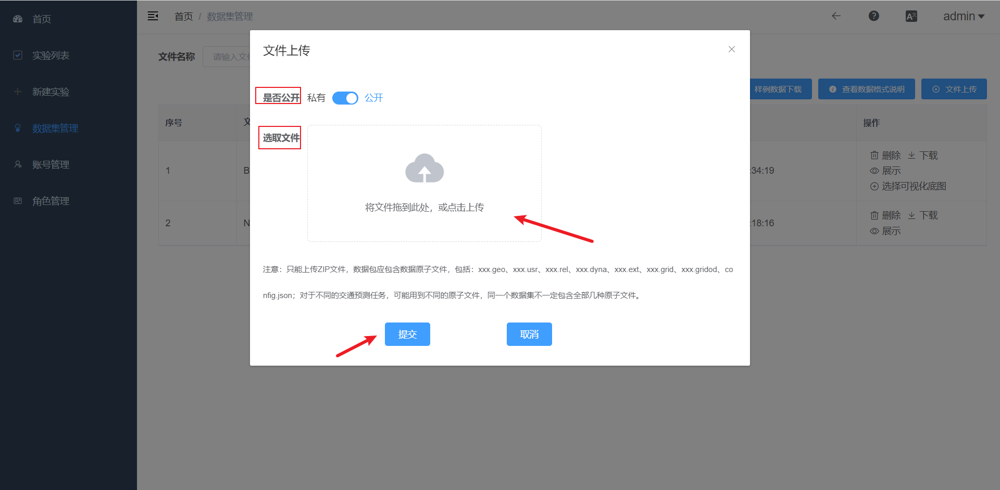
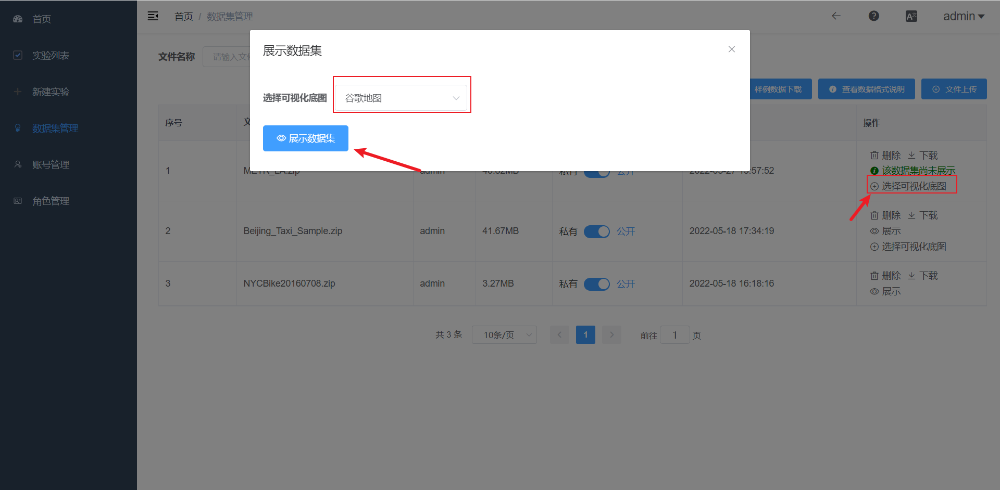
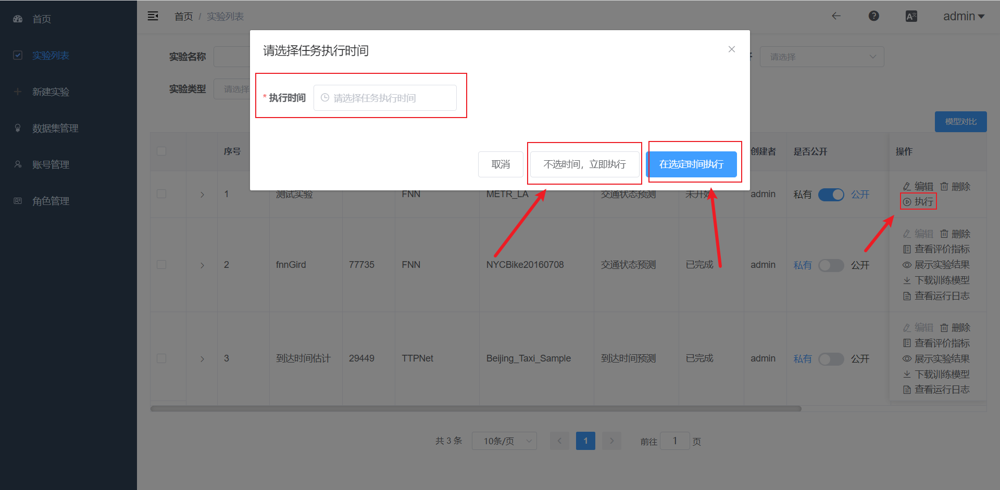
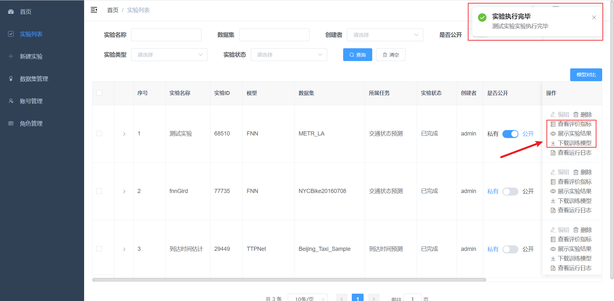
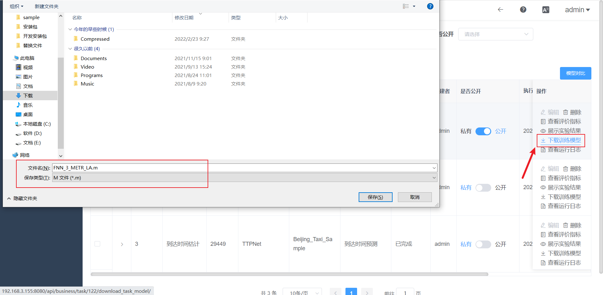
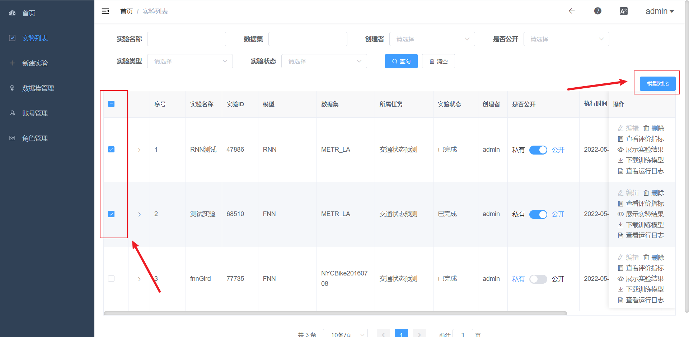

# User Manual

This document is an instruction manual for using the LibCity experiment management system. Here the process of the traffic state prediction experiment is used as an example.

## 1 Register and login to the system

First, open the system home page, enter the account password, click login to enter the system; if you do not have an account, you can click the "No account? Click the "Register" link at the bottom right to enter the registration page and fill in the relevant information to complete the registration. The login interface is shown as follows.

## 2 Uploading datasets

### 2.1 Downloading datasets supported by the platform

To complete an experiment, we need to prepare the dataset needed for the experiment first, so how do we get the dataset? In the platform home page, you can find the dataset files that have been provided, we can click into download the corresponding dataset.

### 2.2 Viewing data format descriptions

Click on "Data set management" in the left menu bar to enter the data set management page; on the data set management page, click on the "View data format descriptions" button in the upper right corner to view the role of each atomic file in the data set and the related information descriptions.

### 2.3 Uploading datasets

In the dataset management page, click the "File Upload" button in the upper right corner to bring up the file upload dialog.

The file upload form has two items: 

1. public or not: if you choose public, all users can view, download and use this dataset; if you choose private, only you can see this dataset, and accordingly, only you can operate it.
2. select file: you can drag and drop the dataset you want to upload into the dashed square, or click on the dashed square to select the file to upload.

After the form is filled, click Submit and the dataset file will be uploaded to the server.

### 2.4 Dataset visualization

After the dataset has been uploaded, the system automatically checks whether the dataset can be visualized.

Three situations will occur for visualization.

1. pass the test: the user can select the map base map for GIS visualization.
2. pass the test: but there is no coordinate data in the dataset file for GIS visualization, then the visualization will show the dataset data as a statistical image.
3. failed to pass the test: an error message will be displayed in response, you can click the "View Error Message" button to see the reason why the dataset cannot be visualized.

Under normal circumstances, after the dataset inspection, the user can click to select the visualization base map to visualize the dataset.

Once the data visualization has been processed, the data set can be viewed by clicking on the Show button.

## 3 New Experiment

Click New Experiment in the left menu bar to enter the New Experiment page.

The New Experiment page is divided into three parts.

1. the filling of the basic parameters of the task: the name of the experiment, the description of the experiment and whether it is public.
2. fill in the required parameters of the task: the task to which it belongs, the model and data set used in the experiment.
3. the filling of the non-required parameters of the task: the configuration of the parameters of the experiment and the upload of the custom configuration file.

It should be noted that there is a strict correspondence between the filling of the required parameters of the task, the task to which the experiment belongs, the model and the dataset, and the correspondence can be viewed by clicking on the link .

## 4 Execute the experiment

After the experiment is created, it will automatically enter the experiment list page and click the Execute button.

You can choose the strategy of experiment execution.

1. execution at a fixed time: after selecting the execution time (can be accurate to the second), click on the selected time to execute, the experiment will be executed at the reserved time, and the reservation time can be modified subsequently.
2. immediate execution: click on the "no time, immediate execution" button, and the experiment will be executed immediately.

## 5 View Experiment Log

After the experiment is executed, you can view the experiment execution log information by clicking the View Run Log button, and you can also download the current log content to.

## 6 Experiment Execution Completed

When the experiment execution is finished, there will be a pop-up box; and you can view the experiment evaluation metrics, visualize the experiment results and download the trained model operation.

### 6.1 View evaluation indicators

Click the View Evaluation Indicators button, which will automatically prompt the evaluation mode of this evaluation indicator. In addition to the basic evaluation indicator view, you can also download the csv file of this experiment evaluation indicator.

### 6.2 Displaying experimental results

On the page of displaying experimental results, you can choose to display three heat maps of predicted results, actual results and the difference between predicted and actual results in the upper right corner; the following figure is the heat map of the difference between predicted and actual values, the larger the difference, the darker the color; the three time axes in the lower left corner are the changes of data over time, from top to bottom, corresponding to the difference, prediction and truth, select a heat map in the upper right corner, and click play in the lower left corner corresponding to the time axis, you can visualize the change of the heat map of data over time.

### 6.3 Downloading the training model

Click the "Download Training Model" button to download the training model file for this experiment

## 7 Multi-Model Comparison

Multi-model metrics comparison is a way to compare the model evaluation metrics of multiple experiments after we have completed them.

Step: Check the multi-select box in front of the experiment you want to compare, and then click the "Model Comparison" button in the upper right corner to compare multiple model metrics.

The model comparison effects are shown below.

- (a) The toolbar in the upper right corner provides functions for restoring the initial state, viewing the original data view, switching line graphs, switching bar graphs and downloading images.
- The right side allows you to check the time step you want to compare.

