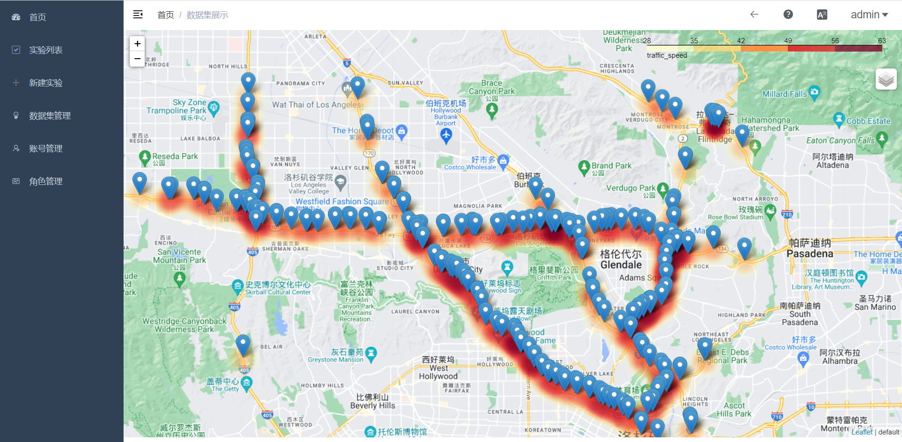
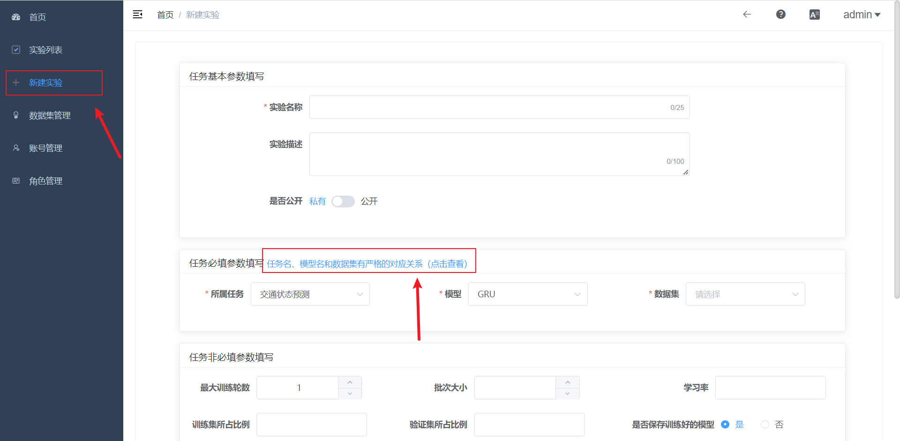
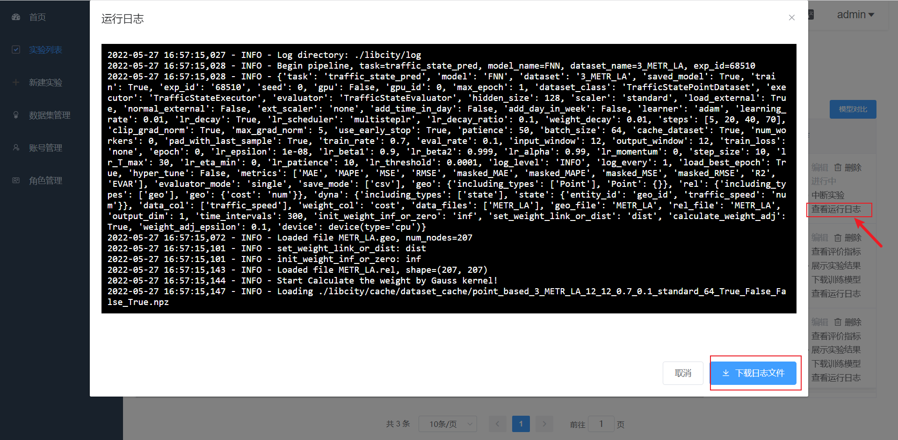
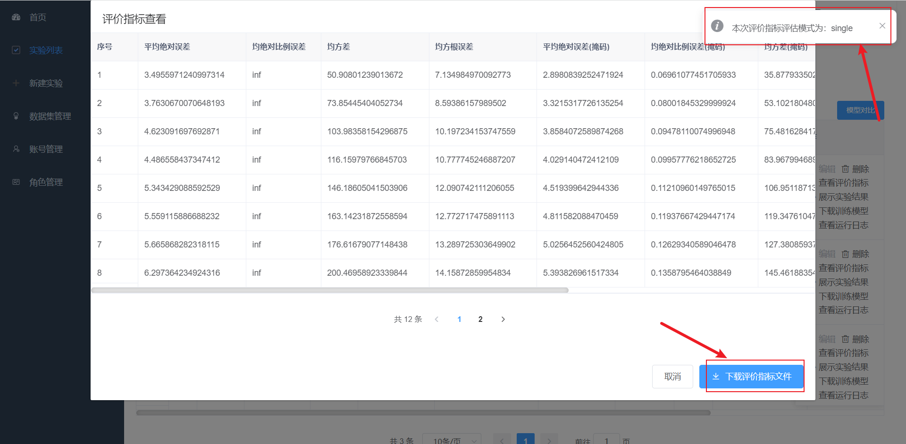
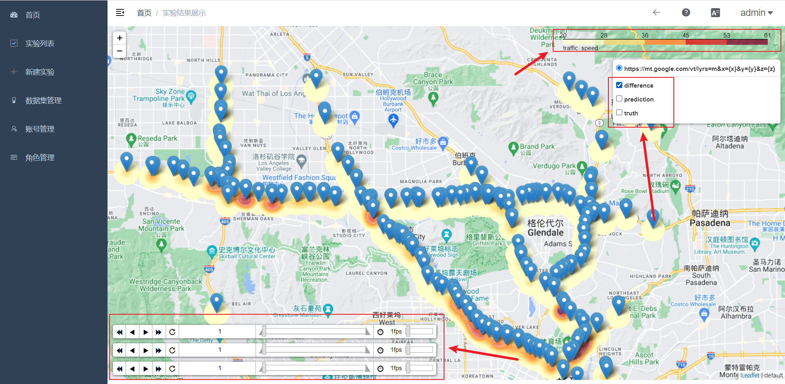
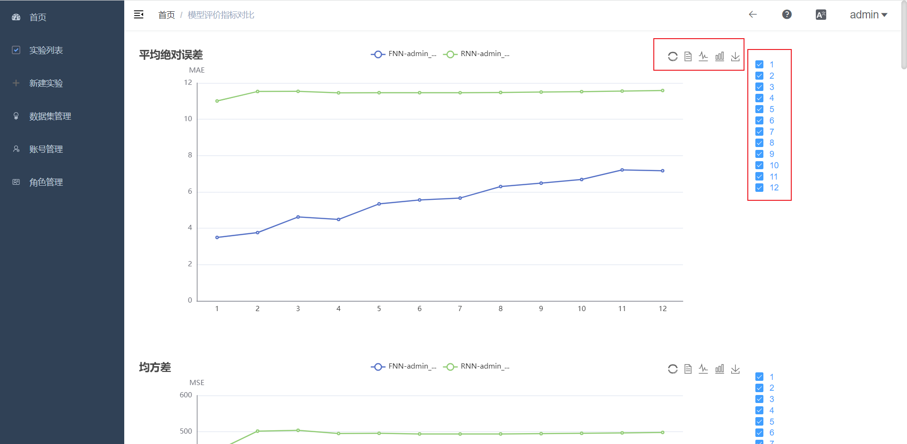

------

   

# Bigscity-LibCity-WebTool

We have developed an experiment management tool for the LibCity platform, which allows users to complete basic functions such as data upload, data visualization, new experiment, experiment run, experiment result display, and experiment comparison in a visual interface.

## Features

### Data set visualization

### Experiment creation and operation

### Experiment Evaluation

### Visualization of experimental results

### Experimental Performance Comparison

## Deployment Manuals

Deployment manuals can be viewed in this [document](./部署手册.md) (Chinese), document (English under development).

## User Manuals

User manuals can be viewed in this [document](./使用手册.md) (Chinese), document (English under development).

## License

LibCity uses [Apache License 2.0](./LICENSE.txt).

